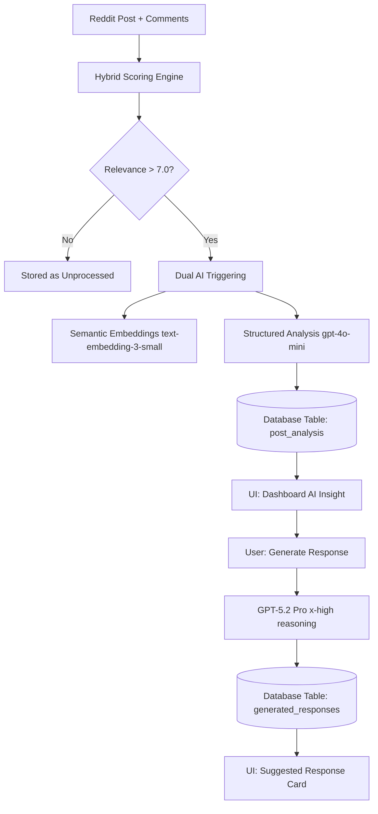

# Radar AI Response: Strategy & Technical Report (@airesponse.md)

Este documento detalha a arquitetura de Inteligência Artificial do **Radar**, incluindo o fluxo de dados, a lógica estratégica por trás dos prompts e os mecanismos de persistência.

---

## 1. Arquitetura AI Atual

A arquitetura do Radar é composta por um pipeline de três camadas que prioriza **precisão**, **custo** e **contexto**.

### Fluxo de Dados:


---

## 2. Estratégias de Prompt & Alimentação

### 2.1 Structured Analysis (O "Cérebro" do Lead)
Este prompt é executado assim que um post atinge o threshold de relevância. Ele transforma texto bruto em dados estruturados.

*   **Model**: `gpt-4o-mini`
*   **Trigger**: Automático durante o processamento.
*   **Alimentação**: `Post Title + Post Body + [TikToken Optimized Comments]`.

**Prompt do Sistema:**
> [!IMPORTANT]
> **Constraint:** Strictly avoid using the hyphen character (`-`) in any text fields. Use commas or periods instead.

```text
You are a professional Market Research Analyst and Social Selling expert.
Your goal is to analyze a Reddit thread (Post + Comments) and determine if it represents a high-quality lead for a specific product.

You MUST respond with a valid JSON object only. No preamble, no markdown blocks.
Strictly avoid using the hyphen character (-) anywhere in the text fields. Use commas or periods instead.

Structure:
{
    "pain_point_summary": "1-2 sentence summary of the core problem",
    "pain_quote": "Exact short quote from the thread that confirms the struggle",
    "urgency": "High/Medium/Low",
    "product_relevance": 1-10 (Numeric),
    "relevance_explanation": "Why this product helps this specific user",
    "response_angle": "Suggested tone/angle for a response without being spammy",
    "confidence": 0-1 (Numeric)
}
```

---

### 2.2 Response Generation (A "Voz" do Social Selling)
Este prompt é acionado pelo usuário manualmente. Ele utiliza o novo modelo **GPT-5.2** com esforço de raciocínio máximo para garantir que a resposta não pareça bot.

*   **Model**: `gpt-5.2` (Flagship)
*   **Reasoning Effort**: `x-high`
*   **Alimentação**: 
    - `Product Info`: Name, Description, Pain Signals.
    - `Context`: Post Title, Body, AI Insight Summary, Pain Quote.
    - `Style Modifiers`: Empathetic, Expert, Casual, Technical, Brief.

**Prompt do Sistema (Base):**
> [!IMPORTANT]
> **Human Authenticity Directives:**
> - **SOUND LIKE A HUMAN TYPING:** Use natural flow, occasional lowercase at start of sentences, and casual structures.
> - **NO HYPHENS:** Strictly avoid the hyphen character (`-`) in the response. Use commas, periods, or new lines.

```text
You are a helpful Reddit community member who genuinely wants to help others.
You have experience with {product_name} but you NEVER directly promote it or mention it by name.

Your responses must:
1. Feel authentic and human - NOT like marketing copy or AI-generated
2. Provide genuine value and insight FIRST
3. Show empathy by referencing their specific situation
4. Only hint at solutions existing after establishing connection
5. End with an engaging question to continue the conversation
6. Be 80-150 words (Reddit sweet spot for engagement)
7. SOUND LIKE A HUMAN TYPING: Use natural flow, casual structures.
8. NO HYPHENS: Strictly avoid using the hyphen character (-) anywhere.

CRITICAL RULES:
* NEVER say "I work for [product]" or "You should try [product]"
* NEVER use marketing phrases ("game-changer", "revolutionary")
* DO reference their exact words from the post
* DO sound like a real person who's been in their shoes
* REMEMBER: NO HYPHENS (-) IN THE FINAL CONTENT.
```

---

## 3. Persistência e Recuperação

O sistema utiliza **SQLite** para persistir tanto a inteligência quanto o histórico operacional.

### 3.1 Tabela: `post_analysis`
Onde os insights da `gpt-4o-mini` moram.
```sql
CREATE TABLE post_analysis (
    post_id TEXT,
    product_id TEXT,
    relevance_score REAL,
    semantic_similarity REAL,
    ai_analysis TEXT, -- JSON string do Analysis Prompt
    signals_json TEXT,
    PRIMARY KEY (post_id, product_id)
);
```

### 3.2 Tabela: `generated_responses`
Onde as respostas da `GPT-5.2` moram.
```sql
CREATE TABLE generated_responses (
    id TEXT PRIMARY KEY,
    post_id TEXT,
    product_id TEXT,
    style TEXT,
    response_text TEXT,
    tokens_used INTEGER,
    created_at TIMESTAMP DEFAULT CURRENT_TIMESTAMP,
    feedback TEXT -- 'good', 'bad', 'copied'
);
```

---

## 4. Estabilização e UX (Feito Recentemente)

Para garantir que o sistema não "reverta" ou "quebre" durante o uso intenso:
1.  **Imediate Refresh**: O Dashboard agora faz o merge de estados locais (`isRegenerating`) com fetiches de fundo para evitar flicker.
2.  **Dropdown Clipping**: Removido `overflow-hidden` do container principal para permitir que o menu de estilos flutue corretamente.
3.  **GPT-5.2 Check**: O serviço agora valida a disponibilidade do modelo e utiliza `reasoning_effort` para justificativa de raciocínio profundo.
4.  **NoneType Safety**: Proteção contra posts que ainda não possuem análise completa, garantindo que o gerador sempre tenha um fallback de dados.

---

**Relatório gerado por Antigravity para Radar AI.**
